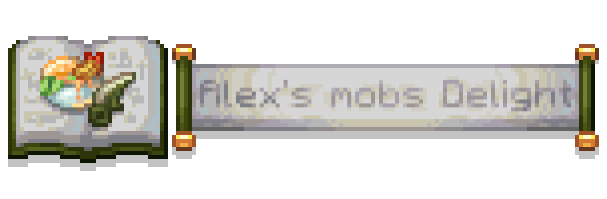

# Alex's Mobs Delight Legacy / Alex 的生物农家乐

## Overview

### About

**Alex's Mobs Delight Legacy** is a Minecraft Forge `1.12.2` addon mod for **Farmer's Delight Legacy** and **Alex's Mobs (Legacy)**.

This project is a `1.12.2` legacy port and adaptation of the modern **Alex's Mobs Delight** mod. It is not the original modern-version project.

Cook up dishes inspired by the creatures of Alex's Mobs (Legacy), turn unusual drops into hearty meals, set out big feasts, grow a few mob-themed crops, and try some creature-made tools along the way. JEI support is included to help track recipes, hunting drops, and the stranger ways some foods are obtained.

- Project GitHub: [xy177 / Alex-s-Mobs-Delight-Legacy](https://github.com/xy177/Alex-s-Mobs-Delight-Legacy)

## Required Dependencies

- `Minecraft Forge 1.12.2`
- `FarmersDelightLegacy`
- `Alex's Mobs (Legacy)`
- `Citadel`

## Optional Compatibility

- `JEI` - Recommended for recipe lookup, hunting-drop displays, and special acquisition hints.
- `Future-MC` - Used where available for modern-style ingredients such as sweet berries, honey bottles, and suspicious stew.
- `OceanicExpanse` - Used where available for ocean ingredients such as kelp, seagrass, and sea pickles.
- `Cherry_on` - Used where available for archaeology-related acquisition behavior and compatible containers.
- `Netherized` / `Unseens Nether Backport` - Used where available for modern Nether ingredients in compatible recipes.

## Features

- Alex's Mobs-themed foods, ingredients, meats, fish slices, sushi, stews, burgers, feasts, and special meals.
- Farmer's Delight Legacy integrations, including cooking pot recipes, cutting board recipes, campfire cooking, furnace cooking, and hunting-drop support.
- Placeable feast and large-food blocks, including kiviak variants, whale dishes, sushi platters, honey-glazed bear meat with salmon, and stuffed steamed whole crocodile.
- Special food mechanics and potion effects inspired by the original mod, including crocodile-themed effects, crystallize walker behavior, kiviak fermentation, and special seagull food behavior.
- Tools and weapons based on Alex's Mobs materials, including crocodile knives, lobster knife behavior, banana bow projectiles, lobster darts, whale tooth pickaxe, seagull wand, and mantis shrimp tools.
- Growable banana and acacia blossom blocks adapted for the `1.12.2` environment.
- JEI descriptions for special acquisition routes such as orca gifts, kiviak opening, mantis shrimp cooking, planted crops, and hunting drops.

## Original Mod

This repository is a legacy port and adaptation of the modern **Alex's Mobs Delight** project.

- Original CurseForge page: [Alex's Mobs Delight](https://www.curseforge.com/minecraft/mc-mods/alexs-mobs-delight)
- Original GitHub source: [rawchickenNEG / AlexsMobsDelight](https://github.com/rawchickenNEG/AlexsMobsDelight)

## License

This project follows the original mod's LGPL-3.0 license. See [LICENSE.txt](LICENSE.txt) for details.
